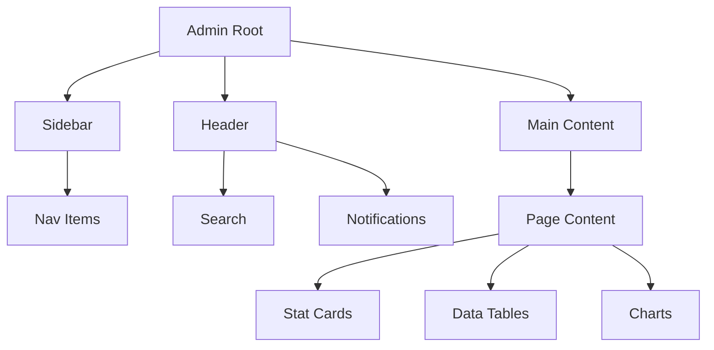

# Admin Panel UI Redesign - Architecture Plan

## Executive Summary

Redesign the Test Chat admin panel from the current slate/sky color scheme to a **dark glassmorphism theme** with purple/blue gradient accents, following the design specifications provided.

## Current State Analysis

### Files to Modify

| File                                                                  | Current Design                                    | Key Elements                      |
| --------------------------------------------------------------------- | ------------------------------------------------- | --------------------------------- |
| [`AdminLogin.tsx`](app-test/src/pages/admin/AdminLogin.tsx:1)         | White card, light background `#f8fafc`            | 147 lines, simple gradient button |
| [`AdminLayout.tsx`](app-test/src/pages/admin/AdminLayout.tsx:1)       | Slate-900 gradient sidebar, sky-500 active states | 223 lines, collapsible sidebar    |
| [`AdminDashboard.tsx`](app-test/src/pages/admin/AdminDashboard.tsx:1) | Sky gradient header, stat cards                   | 321 lines, 6 stat cards, 2 charts |
| [`AdminUsers.tsx`](app-test/src/pages/admin/AdminUsers.tsx:1)         | Standard table, basic cards                       | 446 lines, user management        |
| [`AdminAnalytics.tsx`](app-test/src/pages/admin/AdminAnalytics.tsx:1) | Mock charts, basic cards                          | 240 lines, 4 stat cards           |
| [`AdminMessages.tsx`](app-test/src/pages/admin/AdminMessages.tsx:1)   | Redirects to compose                              | 17 lines                          |

### Components to Update

| Component                                                            | Current                   | Target           |
| -------------------------------------------------------------------- | ------------------------- | ---------------- |
| [`Button.tsx`](app-test/src/components/admin/Button.tsx:1)           | Slate variants            | Glass + gradient |
| [`Card.tsx`](app-test/src/components/admin/Card.tsx:1)               | White bg, shadow-sm       | Glassmorphism    |
| [`Modal.tsx`](app-test/src/components/admin/Modal.tsx:1)             | White bg                  | Dark glass       |
| [`StatCard.tsx`](app-test/src/components/admin/StatCard.tsx:1)       | White bg, colored icon bg | Glass with glow  |
| [`Badge.tsx`](app-test/src/components/admin/Badge.tsx:1)             | Light bg badges           | Glass badges     |
| [`SearchInput.tsx`](app-test/src/components/admin/SearchInput.tsx:1) | White bg input            | Glass input      |
| [`Toast.tsx`](app-test/src/components/admin/Toast.tsx:1)             | Colored toasts            | Glass toasts     |

---

## Implementation Plan

### Phase 1: Global CSS Variables & Base Styles

**File:** [`app-test/src/index.css`](app-test/src/index.css:1)

Add admin-specific CSS variables and global styles:

```css
/* Admin Dark Glass Theme */
:root {
  --admin-bg-primary: #0d0d1a;
  --admin-bg-secondary: #12122a;
  --admin-bg-tertiary: #1a1a35;

  /* Purple/Blue Gradient Accents */
  --admin-accent-1: #7c3aed;
  --admin-accent-2: #4f46e5;
  --admin-accent-3: #0ea5e9;
  --admin-gradient: linear-gradient(135deg, #7c3aed, #4f46e5, #0ea5e9);

  /* Glass Effects */
  --admin-glass: rgba(255, 255, 255, 0.04);
  --admin-glass-hover: rgba(255, 255, 255, 0.08);
  --admin-glass-active: rgba(255, 255, 255, 0.12);
  --admin-border: rgba(255, 255, 255, 0.08);
  --admin-border-hover: rgba(255, 255, 255, 0.16);
  --admin-blur: blur(24px);

  /* Text Colors */
  --admin-text-primary: rgba(255, 255, 255, 0.95);
  --admin-text-secondary: rgba(255, 255, 255, 0.55);
  --admin-text-muted: rgba(255, 255, 255, 0.3);

  /* Status Colors */
  --admin-success: #10b981;
  --admin-warning: #f59e0b;
  --admin-danger: #ef4444;
  --admin-info: #0ea5e9;

  /* Glow Effects */
  --admin-glow-purple: 0 0 20px rgba(124, 58, 237, 0.4);
  --admin-glow-blue: 0 0 20px rgba(14, 165, 233, 0.4);
  --admin-glow-green: 0 0 20px rgba(16, 185, 129, 0.3);
}

/* Admin Root Background */
.admin-root {
  background: radial-gradient(
    ellipse at top left,
    #1a0533 0%,
    #0d0d1a 40%,
    #0a0a1f 100%
  );
  min-height: 100vh;
  position: relative;
  overflow: hidden;
}

/* Floating ambient orbs */
.admin-root::before {
  content: "";
  position: fixed;
  top: -200px;
  left: -200px;
  width: 600px;
  height: 600px;
  background: radial-gradient(
    circle,
    rgba(124, 58, 237, 0.15) 0%,
    transparent 70%
  );
  pointer-events: none;
  z-index: 0;
}

.admin-root::after {
  content: "";
  position: fixed;
  bottom: -200px;
  right: -100px;
  width: 500px;
  height: 500px;
  background: radial-gradient(
    circle,
    rgba(14, 165, 233, 0.12) 0%,
    transparent 70%
  );
  pointer-events: none;
  z-index: 0;
}

/* Custom Admin Scrollbar */
.admin-root ::-webkit-scrollbar {
  width: 6px;
}
.admin-root ::-webkit-scrollbar-track {
  background: rgba(255, 255, 255, 0.02);
}
.admin-root ::-webkit-scrollbar-thumb {
  background: rgba(255, 255, 255, 0.1);
  border-radius: 3px;
}
.admin-root ::-webkit-scrollbar-thumb:hover {
  background: rgba(124, 58, 237, 0.4);
}
```

### Phase 2: Core Component Updates

#### 2.1 Button Component ([`Button.tsx`](app-test/src/components/admin/Button.tsx:1))

Add glassmorphism variants:

```typescript
// New variants to add
glass: 'bg-white/10 border border-white/20 text-white backdrop-blur-sm hover:bg-white/20',
primary: 'bg-gradient-to-r from-violet-600 to-indigo-600 text-white shadow-lg shadow-violet-500/25',
danger: 'bg-red-500/20 border border-red-500/30 text-red-400 hover:bg-red-500/30',
```

#### 2.2 Card Component ([`Card.tsx`](app-test/src/components/admin/Card.tsx:1))

Add glassmorphism style:

```typescript
className = "bg-white/5 border border-white/10 backdrop-blur-xl rounded-2xl";
```

#### 2.3 Modal Component ([`Modal.tsx`](app-test/src/components/admin/Modal.tsx:1))

Update to dark glass:

```typescript
// Backdrop
bg-black/60 backdrop-blur-xl

// Modal content
bg-[#0d0d1a]/95 border border-white/10 backdrop-blur-2xl
```

#### 2.4 StatCard Component ([`StatCard.tsx`](app-test/src/components/admin/StatCard.tsx:1))

Add gradient top border and glow effects:

```typescript
// Add ::before pseudo-element for gradient accent
// Add hover:translateY(-3px) for lift effect
// Add box-shadow on hover
```

#### 2.5 Badge Component ([`Badge.tsx`](app-test/src/components/admin/Badge.tsx:1))

Add glass variants:

```typescript
glass: 'bg-white/10 border border-white/20 text-white',
success: 'bg-emerald-500/20 border border-emerald-500/30 text-emerald-400',
danger: 'bg-red-500/20 border border-red-500/30 text-red-400',
```

#### 2.6 SearchInput Component ([`SearchInput.tsx`](app-test/src/components/admin/SearchInput.tsx:1))

Add glass styling:

```typescript
className =
  "bg-white/10 border border-white/20 text-white placeholder-white/40 backdrop-blur-sm focus:border-violet-500/50";
```

### Phase 3: Page-Level Updates

#### 3.1 AdminLogin ([`AdminLogin.tsx`](app-test/src/pages/admin/AdminLogin.tsx:1))

| Element      | Current          | Target                            |
| ------------ | ---------------- | --------------------------------- |
| Container    | `#f8fafc` bg     | Radial gradient + orbs            |
| Login Card   | White bg, shadow | Glass: `bg-white/4`, border, blur |
| Logo         | Gradient icon    | Gradient with glow                |
| Headings     | Gray text        | White/gradient text               |
| Input Fields | White bg         | Glass style                       |
| Button       | Sky gradient     | Purple-blue gradient with shimmer |
| Error Alert  | Red bg           | Red glass alert                   |

#### 3.2 AdminLayout ([`AdminLayout.tsx`](app-test/src/pages/admin/AdminLayout.tsx:1))

| Element          | Current                 | Target                         |
| ---------------- | ----------------------- | ------------------------------ |
| Sidebar          | Slate-900 gradient      | Glass: `bg-white/3`, blur      |
| Nav Items        | Slate hover, sky active | Glass hover, gradient active   |
| Active Indicator | Sky bg                  | Purple/blue gradient + glow    |
| Header           | White/slate bg          | Glass: `bg-[#0d0d1a]/80`, blur |
| Search           | White/slate             | Glass input                    |

#### 3.3 AdminDashboard ([`AdminDashboard.tsx`](app-test/src/pages/admin/AdminDashboard.tsx:1))

| Element        | Current          | Target                          |
| -------------- | ---------------- | ------------------------------- |
| Welcome Banner | Sky gradient     | Glass + gradient + grid pattern |
| Stat Cards     | White bg         | Glass + gradient top border     |
| Charts         | Light card       | Glass card                      |
| Quick Actions  | Colored bg cards | Glass hover cards               |

#### 3.4 AdminUsers ([`AdminUsers.tsx`](app-test/src/pages/admin/AdminUsers.tsx:1))

| Element       | Current    | Target              |
| ------------- | ---------- | ------------------- |
| Table         | White bg   | Glass bg            |
| Table Head    | Slate-50   | Glass: `bg-white/5` |
| Table Rows    | Hover bg   | Glass hover         |
| Status Badges | Colored bg | Glass badges        |
| Action Menu   | White bg   | Dark glass dropdown |

#### 3.5 AdminAnalytics ([`AdminAnalytics.tsx`](app-test/src/pages/admin/AdminAnalytics.tsx:1))

| Element       | Current     | Target      |
| ------------- | ----------- | ----------- |
| Charts        | Light cards | Glass cards |
| Progress Bars | Light bg    | Glass bg    |

### Phase 4: Animations & Interactions

Add to global CSS:

```css
/* Page load animation */
@keyframes adminFadeIn {
  from {
    opacity: 0;
    transform: translateY(10px);
  }
  to {
    opacity: 1;
    transform: translateY(0);
  }
}

/* Card hover lift */
.admin-card {
  transition:
    transform 0.2s ease,
    box-shadow 0.2s ease,
    background 0.2s ease;
}
.admin-card:hover {
  transform: translateY(-3px);
  box-shadow: 0 20px 40px rgba(0, 0, 0, 0.3);
}

/* Glow pulse for online indicators */
@keyframes glowPulse {
  0%,
  100% {
    box-shadow: 0 0 4px rgba(16, 185, 129, 0.4);
  }
  50% {
    box-shadow: 0 0 12px rgba(16, 185, 129, 0.8);
  }
}

/* Shimmer effect for buttons */
@keyframes shimmer {
  from {
    left: -100%;
  }
  to {
    left: 100%;
  }
}
```

---

## File Modification Order

1. **index.css** - Add global CSS variables and admin root styles
2. **Button.tsx** - Add glass variants
3. **Card.tsx** - Add glass styling
4. **Modal.tsx** - Update to dark glass
5. **StatCard.tsx** - Add gradient accents + hover effects
6. **Badge.tsx** - Add glass variants
7. **SearchInput.tsx** - Add glass styling
8. **Toast.tsx** - Update to glass style
9. **AdminLogin.tsx** - Full redesign
10. **AdminLayout.tsx** - Sidebar + header redesign
11. **AdminDashboard.tsx** - Stats + charts redesign
12. **AdminUsers.tsx** - Table redesign
13. **AdminAnalytics.tsx** - Charts redesign

---

## Design System Summary

### Color Palette

| Purpose              | Color     | Usage             |
| -------------------- | --------- | ----------------- |
| Background Primary   | `#0d0d1a` | Main admin bg     |
| Background Secondary | `#12122a` | Cards, panels     |
| Accent Purple        | `#7c3aed` | Primary actions   |
| Accent Blue          | `#4f46e5` | Secondary accent  |
| Accent Cyan          | `#0EA5E9` | Info, links       |
| Success              | `#10b981` | Online, success   |
| Warning              | `#f59e0b` | Pending, warnings |
| Danger               | `#ef4444` | Errors, bans      |

### Component Patterns



### Key Design Elements

- **Glass Effect**: `bg-white/5` + `backdrop-blur-xl` + border
- **Gradient Accents**: Purple → Blue → Cyan
- **Glow Effects**: Box-shadow with accent colors
- **Animations**: Fade in on load, lift on hover, pulse for indicators
- **No White Backgrounds**: All surfaces use transparency

---

## Acceptance Criteria

1. ✅ Login page shows dark gradient background with floating orbs
2. ✅ Login card has glass effect with blur
3. ✅ Sidebar has glass effect with purple/blue gradient active states
4. ✅ Sidebar collapse/expand animation is smooth
5. ✅ Dashboard stats cards have hover lift effect
6. ✅ Charts render in dark theme (no white backgrounds)
7. ✅ Users table has glass rows with hover effects
8. ✅ Toggles have smooth animation matching reference
9. ✅ Dropdowns open in dark glass style
10. ✅ Buttons have gradient glow effects
11. ✅ Modals show with backdrop blur
12. ✅ Custom dark scrollbar styling
13. ✅ Consistent purple/blue dark glassmorphism throughout
14. ✅ No white or light backgrounds visible in admin

---

## Notes

- All changes are **frontend-only** - no backend modifications
- Maintain existing functionality and data flow
- Ensure responsive design works on mobile
- Test all interactive elements (hover, focus, active states)
- Verify accessibility (contrast ratios, keyboard navigation)
